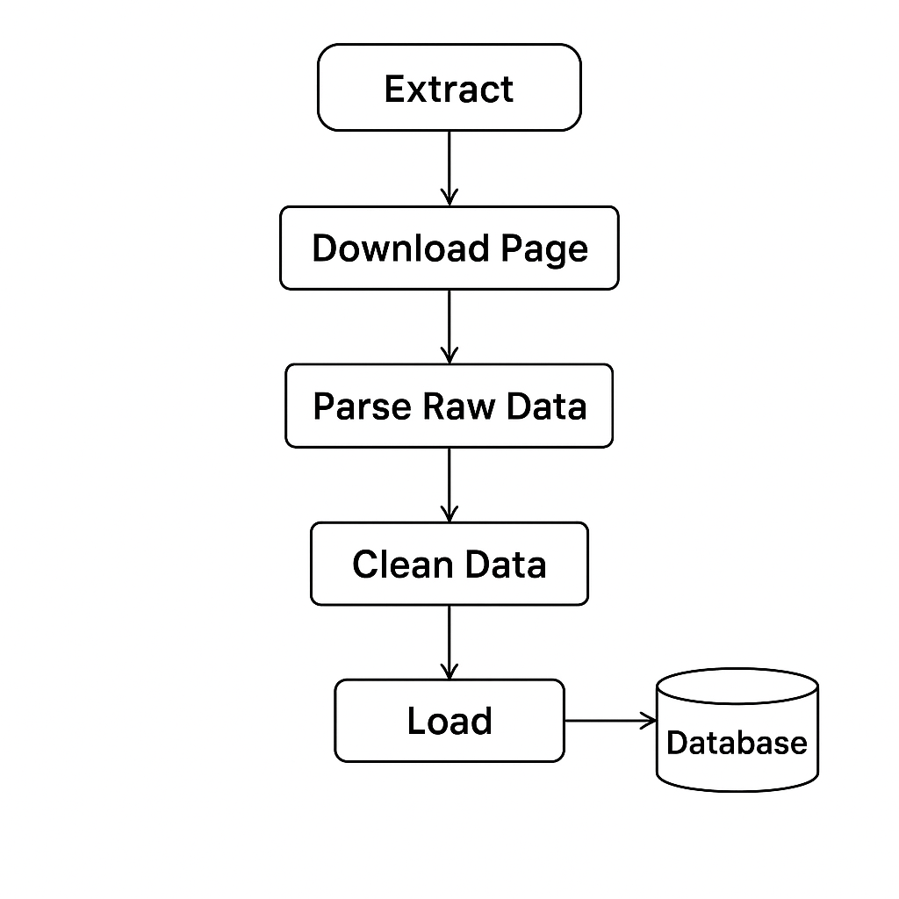

# PakWheels Used Cars Scraper

**Overview:**

This is a simple scraper and ETL pipeline for extracting used car listings from PakWheels (a Pakistani car marketplace). The pipeline downloads an HTML page, parses listing details, cleans numeric fields, writes raw and cleaned CSVs, and uploads the cleaned data to a SQL Server database.

**What’s included:**

- `used_cars_data_scrapping.ipynb` — main notebook with scraper, parser, cleaner, logger, pipeline orchestration, and an example `__main__` run.
- `used_cars_raw_data.csv` — example/raw scraped output (CSV).
- `used_cars_data.csv` — cleaned dataset exported by the notebook (CSV).
- `pipeline_log.txt` — pipeline execution log (appended by the notebook's logger functions).

High-level pipeline steps (as implemented in the notebook):

1. Download HTML from PakWheels listing page using `requests` with a browser `User-Agent`.
2. Parse listings using `BeautifulSoup` to extract fields: title, price, location, image link, ad link, model, kilometers, fuel, engine, transmission.
3. Save parsed raw records to `used_cars_raw_data.csv`.
4. Read the raw CSV and clean numeric fields (`price`, `engine`, `kilometers`) using simple string replacement and `pandas.to_numeric`.
5. Save cleaned output to `used_cars_data.csv`.
6. Optionally upload cleaned data to a SQL Server table via SQLAlchemy if a connection string is provided.
7. Log pipeline steps and errors to `pipeline_log.txt`.


How to run

Follow these steps to clone the repository, and run the notebook.

1) Clone the repository :

```powershell
git clone https://github.com/mtahashahid/cloud-data-engineering.git
cd cloud-data-engineering 
```

2) Open and run the notebook interactively:

```powershell
jupyter lab
# then open used_cars_data_scrapping.ipynb and run main cell.
```

Run pipeline as a script (quick method)

The notebook includes a `__main__` section that calls `run_pipeline(...)`. To run the same logic as a script you can convert the notebook to a Python script and run it:

```powershell
jupyter nbconvert --to script used_cars_data_scrapping.ipynb
python used_cars_data_scrapping.py
```

**How the Pipeline Works:**

Extract → Save Raw CSV → Load Raw CSV → Clean → Save Clean CSV → Database Connection → Load to DB (SQL Server)



Notes & cautions

- The notebook targets `https://www.pakwheels.com/used-cars/search/-/featured_1/` and relies on the page structure. If PakWheels changes their HTML layout or CSS classes, the parser will need updates.
- Respect the target site's `robots.txt` and terms of service. Add delays and backoff if running automated scraping to avoid being blocked.
- The example SQL connection string inside the notebook is for demonstration. If you plan to upload to SQL Server, ensure `pyodbc` is configured and the appropriate ODBC driver is installed on your system.
 
Suggested next steps

- Add a `requirements.txt` file for this folder with pinned versions used in the notebook.
- Add CLI wrapper (e.g., `scrape.py`) to run the pipeline outside Jupyter.
- Add basic unit tests for parsing functions using sample HTML snippets.
