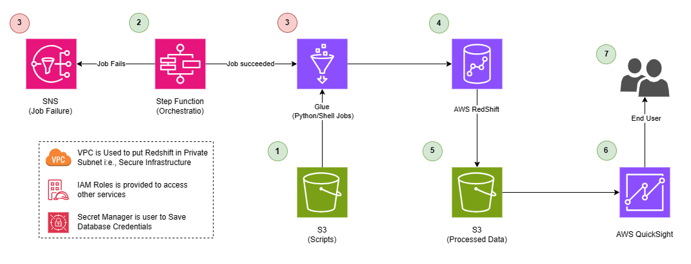

# ETL Orchestration on AWS

A complete Extract, Transform, and Load (ETL) pipeline orchestrated using **AWS Step Functions** and **AWS Glue**, with data storage in **Amazon Redshift** and **S3**. This project demonstrates enterprise-grade data engineering practices on AWS.

## 📋 Table of Contents

- [Overview](#overview)
- [Architecture](#architecture)
- [Project Structure](#project-structure)
- [Prerequisites](#prerequisites)
- [Setup Instructions](#setup-instructions)
- [Configuration](#configuration)
- [Usage](#usage)
- [Workflow Details](#workflow-details)
- [Database Schema](#database-schema)
- [IAM Policies](#iam-policies)
- [Monitoring & Alerts](#monitoring--alerts)
- [Troubleshooting](#troubleshooting)

## 🎯 Overview

This project implements an automated ETL pipeline that:
- **Extracts** Amazon review data from external Glue catalogs
- **Transforms** the data using Redshift SQL queries (filtering, aggregation, analysis)
- **Loads** processed data into Redshift for analytics
- **Orchestrates** the entire workflow using AWS Step Functions
- **Notifies** stakeholders via SNS on job failures

The pipeline processes historical Amazon product reviews (2015 onwards) and generates analytical reports on top-reviewed products.

## 🏗️ Architecture

Archiecture will be:



## 📁 Project Structure

```
ETL Orchestration on AWS/
├── README.md                              # This file
├── etl-orchestration.drawio              # Architecture diagram (Draw.io format)
├── etl-orchestration.drawio.png          # Architecture diagram image
├── codes/
│   ├── IAM/
│   │   ├── glue_demo_policy.json         # Glue job permissions
│   │   ├── step_functions_demo_policy.json # Step Functions permissions
│   │   └── redshift_demo_policy.json     # Redshift permissions
│   ├── s3/
│   │   ├── python/
│   │   │   ├── rs_query.py               # Redshift query executor
│   │   │   └── redshift_module-0.1-py3.6.egg # Redshift module
│   │   └── sql/
│   │       ├── reviewsschema.sql         # External schema definition
│   │       ├── etl.sql                   # ETL data pipeline
│   │       └── topreviews.sql            # Top reviews report query
│   ├── Step_functions/
│   │   └── state_machine.json            # Step Functions state machine
│   └── quicksight/
│       └── manifest.json                 # QuickSight data source manifest
└── docs/
    └── zip/                              # Documentation archives
```

## ✅ Prerequisites

Before deploying this solution, ensure you have:

1. **AWS Account** with appropriate permissions
2. **AWS Services**:
   - AWS Glue
   - AWS Step Functions
   - Amazon Redshift cluster
   - Amazon S3
   - AWS Secrets Manager
   - AWS IAM
   - Amazon SNS (for notifications)

3. **Access Credentials**:
   - AWS CLI configured with appropriate credentials
   - IAM roles with necessary permissions (provided in `codes/IAM/`)

4. **Database Setup**:
   - Redshift cluster running and accessible
   - External data catalog configured
   - S3 buckets created for scripts and data

## 🚀 Setup Instructions

### 1. Create S3 Buckets

```bash
# Script bucket (for SQL files and Python scripts)
aws s3 mb s3://stack2-scriptbucket-nsqka0hyhfqi --region us-east-1

# Data bucket (for unloaded results)
aws s3 mb s3://redshift-databucket261191 --region us-east-1
```

### 2. Upload SQL Files to S3

```bash
aws s3 cp codes/s3/sql/etl.sql s3://stack2-scriptbucket-nsqka0hyhfqi/sql/
aws s3 cp codes/s3/sql/topreviews.sql s3://stack2-scriptbucket-nsqka0hyhfqi/sql/
aws s3 cp codes/s3/sql/reviewsschema.sql s3://stack2-scriptbucket-nsqka0hyhfqi/sql/
```

### 3. Upload Python Scripts to S3

```bash
aws s3 cp codes/s3/python/rs_query.py s3://stack2-scriptbucket-nsqka0hyhfqi/python/
aws s3 cp codes/s3/python/redshift_module-0.1-py3.6.egg s3://stack2-scriptbucket-nsqka0hyhfqi/python/
```

### 4. Create IAM Roles and Policies

Apply the IAM policies from `codes/IAM/`:

- **Glue Role Policy**: Allows Glue jobs to access S3 and Secrets Manager
- **Step Functions Role Policy**: Allows orchestration of Glue and SNS
- **Redshift Role Policy**: Allows Redshift to access external data sources

```bash
# Create roles and attach policies from codes/IAM/*.json
aws iam create-role --role-name myproject_gluejob_role --assume-role-policy-document file://trust-policy.json
aws iam put-role-policy --role-name myproject_gluejob_role --policy-name glue-policy --policy-document file://codes/IAM/glue_demo_policy.json
```

### 5. Create Redshift External Schema

Execute `codes/s3/sql/reviewsschema.sql` in your Redshift database to create the external schema linking to your Glue catalog.

### 6. Store Database Credentials in Secrets Manager

```bash
aws secretsmanager create-secret \
    --name reviewssecret \
    --description "Redshift credentials for reviews database" \
    --secret-string '{"host":"your-redshift-host","port":5439,"user":"admin","password":"your-password","database":"reviews"}'
```

### 7. Create Glue Job

Create a Glue job named `myglue` that:
- Uses Python 3.6 runtime
- Points to the `rs_query.py` script in S3
- Has the appropriate IAM role attached
- Sets up Redshift module library

### 8. Create Step Functions State Machine

Create a new state machine in AWS Step Functions and import the definition from `codes/Step_functions/state_machine.json`.

Update the ARNs in the state machine to match your AWS account and resources:
- Glue job ARN
- SNS topic ARN
- S3 bucket names

### 9. Create SNS Topic for Alerts

```bash
aws sns create-topic --name alarm-topic --region us-east-1
aws sns subscribe --topic-arn arn:aws:sns:us-east-1:YOUR-ACCOUNT-ID:alarm-topic --protocol email --notification-endpoint your-email@example.com
```

## ⚙️ Configuration

### Key Parameters

Update these in the Step Functions state machine definition:

| Parameter | Description | Example |
|-----------|-------------|---------|
| `JobName` | Glue job name | `myglue` |
| `db` | Redshift database name | `reviews` |
| `db_creds` | Secrets Manager secret name | `reviewssecret` |
| `bucket` | S3 bucket for scripts | `stack2-scriptbucket-nsqka0hyhfqi` |
| `file` | Path to SQL script in S3 | `sql/etl.sql` |

### Environment Variables

Update in Glue job configuration:
- `PYTHONPATH`: Include path to redshift_module
- `REDSHIFT_IAM_ROLE`: IAM role for Redshift access

## 🔄 Usage

### Manual Execution

Start the Step Functions state machine:

```bash
aws stepfunctions start-execution \
    --state-machine-arn arn:aws:states:us-east-1:ACCOUNT-ID:stateMachine:etl-orchestration \
    --name execution-$(date +%s)
```

### Scheduled Execution

Create an EventBridge rule to trigger the state machine on a schedule:

```bash
aws events put-rule --name etl-daily-trigger --schedule-expression "cron(0 2 * * ? *)"
aws events put-targets --rule etl-daily-trigger --targets "Id"="1","Arn"="arn:aws:states:us-east-1:ACCOUNT-ID:stateMachine:etl-orchestration"
```

### Monitor Execution

View execution status in AWS Console or via CLI:

```bash
aws stepfunctions describe-execution --execution-arn <execution-arn>
aws stepfunctions get-execution-history --execution-arn <execution-arn>
```

## 🔄 Workflow Details

### Step 1: ReadFilterJob

**Purpose**: Extract and filter Amazon reviews from external catalog

**Process**:
1. Reads from external Glue catalog table `amzreviews.reviews`
2. Filters reviews from year 2015 onwards
3. Inserts cleaned data into `public.reviews` table in Redshift

**SQL Query**: Defined in `codes/s3/sql/etl.sql`

**Error Handling**: Triggers SNS notification on failure

### Step 2: ReportJob

**Purpose**: Generate analytical report on top-reviewed products

**Process**:
1. Aggregates reviews by marketplace, category, product, and review
2. Calculates average star rating per product
3. Sorts by helpful votes and average rating
4. Unloads results to S3 for further analysis

**SQL Query**: Defined in `codes/s3/sql/topreviews.sql`

**Output**: Parquet/CSV files in `s3://redshift-databucket261191/testunload/`

### Step 3: NotifyFailure (Conditional)

**Purpose**: Alert stakeholders on pipeline failures

**Triggers on**: TaskFailed exception from ReadFilterJob or ReportJob

**Channel**: AWS SNS topic with email notifications

## 🗄️ Database Schema

### External Schema: `amzreviews`

Links to AWS Glue Data Catalog with Amazon reviews data.

**Table**: `amzreviews.reviews`

| Column | Type | Description |
|--------|------|-------------|
| `marketplace` | varchar(10) | Product marketplace (e.g., US, UK) |
| `customer_id` | varchar(15) | Customer identifier |
| `review_id` | varchar(15) | Unique review identifier |
| `product_id` | varchar(25) | Product identifier |
| `product_parent` | varchar(15) | Parent product category ID |
| `product_title` | varchar(50) | Product name |
| `star_rating` | int | Rating (1-5 stars) |
| `helpful_votes` | int | Number of helpful votes |
| `total_votes` | int | Total votes received |
| `vine` | varchar(5) | Vine review flag |
| `verified_purchase` | varchar(5) | Verified purchase flag |
| `review_date` | date | Date review was posted |
| `year` | int | Year of review (partition key) |
| `product_category` | varchar(25) | Product category (partition key) |

### Redshift Tables

**Table**: `public.reviews`

Cleaned and filtered reviews data (year >= 2015)

**Schema Creation**: Run `codes/s3/sql/reviewsschema.sql`

## 🔐 IAM Policies

### Glue Job Policy (`glue_demo_policy.json`)

Permissions:
- `s3:GetBucketLocation`, `s3:GetObject`, `s3:ListBucket` on script bucket
- `secretsmanager:*` on Redshift credentials secret

### Step Functions Policy (`step_functions_demo_policy.json`)

Permissions:
- `glue:StartJobRun` for launching Glue jobs
- `sns:Publish` for sending notifications
- `states:*` for state machine execution

### Redshift Policy (`redshift_demo_policy.json`)

Permissions:
- IAM role assumption for accessing external data
- S3 access for Redshift unload operations

## 📊 Monitoring & Alerts

### CloudWatch Metrics

Monitor these metrics:
- Glue job success/failure rate
- Step Functions execution duration
- Redshift query performance
- S3 data volume

### SNS Notifications

Receive alerts for:
- Pipeline failures
- Job timeouts
- Query errors

Subscribe via AWS Console or CLI.

### Logs

View logs in:
- **AWS Glue**: Glue job execution logs
- **Step Functions**: Execution history and state transitions
- **Redshift**: Query logs and system tables

## 🔧 Troubleshooting

### Issue: "Access Denied" errors

**Solution**: 
- Verify IAM roles have correct permissions
- Check S3 bucket policies
- Ensure Secrets Manager secret is accessible

### Issue: Redshift connection fails

**Solution**:
- Verify security group allows Glue to Redshift traffic
- Check Redshift cluster status
- Validate credentials in Secrets Manager

### Issue: SQL query fails

**Solution**:
- Test SQL queries directly in Redshift Query Editor
- Check external table schema matches Glue catalog
- Verify data types and column names

### Issue: Step Functions state machine timeout

**Solution**:
- Increase job timeout in state machine definition
- Optimize Redshift queries for performance
- Check Glue job resource allocation (DPU)

## 📝 Additional Resources

- [AWS Glue Documentation](https://docs.aws.amazon.com/glue/)
- [AWS Step Functions Documentation](https://docs.aws.amazon.com/stepfunctions/)
- [Amazon Redshift Documentation](https://docs.aws.amazon.com/redshift/)
- [Architecture Diagram](./etl-orchestration.drawio.png)

## 📄 License

This project is provided as-is for educational and enterprise use.

## 👥 Support

For issues or questions, please refer to:
- AWS support documentation
- Project team contacts
- Architecture review documentation
